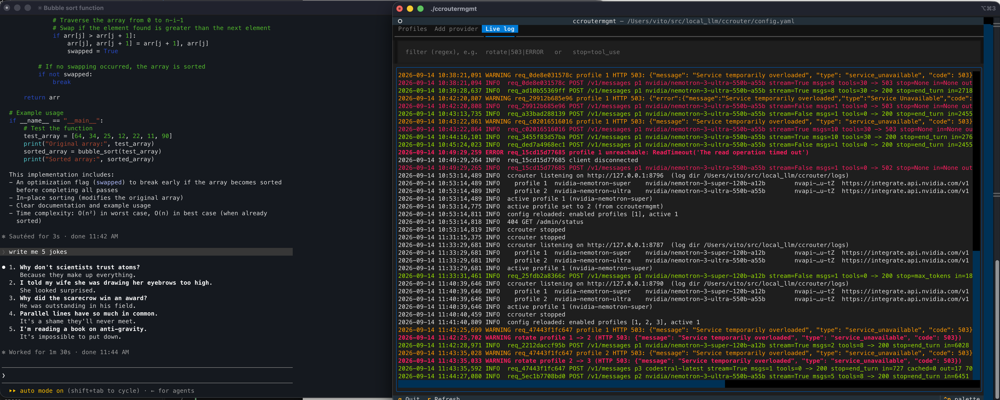

# Claude-Code-Local

Run Claude Code against something other than Anthropic's servers — **a local
model on your Mac's GPU**, or **a hosted provider's free tier** through a small
router that fails over to the next one when a provider runs out.

```
                      ┌── local model on the Mac's GPU  (vllm-mlx · MLX · fully offline)
Claude Code ──────────┤
        /v1/messages  └── ccrouter ──▶ NVIDIA · Mistral · Groq · OpenRouter · 10 more
```

One command either way: `./install.sh`, then `cclocal`.

---

> ### \*\*\*\* DISCLAIMER \*\*\*\*
>
> This is a **PoC and not for production use**. It's a lab test for
> demonstration and training. If you are serious about using Claude Code, you
> must — and I strongly advise — get a subscription. Using a non-Anthropic
> model doesn't bring you the full experience. It's also a violation of the
> terms of use, so I strongly encourage you to use other products like
> [opencode](https://opencode.ai) or pi. **Claude Code requires a
> subscription.**

---

## Two ways to run it

| | **ccrouter** — hosted providers | **Local** — your Mac's GPU |
|---|---|---|
| Runs on | someone else's GPU, over the network | your machine, fully offline |
| Model size | up to **550B** (NVIDIA Nemotron 3 Ultra) | what fits in unified memory, ~5–27B |
| Needs | a free API key, 2 minutes | 16GB+ Mac, a model download |
| Costs | free tiers, or pennies | electricity |
| Privacy | **your prompts and code go to the provider** | nothing leaves the Mac |
| Start | `cclocal --ccrouter` | `cclocal` |

No Anthropic account or subscription is needed for either — `cclocal` gives
Claude Code a dummy credential and points it at your own endpoint. Read the
disclaimer above before you rely on that.

## Quick start

```bash
git clone https://github.com/vitorallo/claude-code-local.git
cd claude-code-local
./install.sh          # venvs, the vllm-mlx fork, and the cclocal + ccroutermgmt commands
```

**Hosted providers** — fastest way in, no download:

```bash
ccroutermgmt          # Profiles tab → k to paste a key → t to test
cclocal --ccrouter    # pick a profile from the menu
```

Free keys in a couple of minutes: [build.nvidia.com](https://build.nvidia.com)
(Nemotron 3 Super, ~40 req/min) and [console.mistral.ai](https://console.mistral.ai)
(Codestral, free *Experiment* plan — note it trains on your data). A fresh
install already has both profiles waiting for their keys.

**Local model** — nothing leaves the Mac:

```bash
cclocal               # interactive menu
cclocal --deckard     # ~6GB, the best balance on a 24GB Mac
cclocal --gemma-light # ~5GB, runs on 16GB
```

First run downloads the model. `install.sh` symlinks `cclocal` into
`~/.local/bin`, so make sure that's on your `PATH`.

---

## ccrouter — one Claude Code session, many providers

Claude Code only speaks Anthropic's `/v1/messages`. Almost every hosted
provider speaks OpenAI's `/v1/chat/completions`. **ccrouter** translates
between them — tools and streaming included — and keeps the session alive
across providers that rate-limit, overload, or stall.



That's the interesting part, and it's visible in the log above: profile 1
returns `503 Service temporarily overloaded`, ccrouter **rotates to profile 2,
retries the same request, and Claude Code never sees the failure** — it just
gets its answer.

- **Numbered profiles.** Each is one provider + key + model, in the gitignored
  `ccrouter/config.yaml`. Keyless providers work too.
- **Rotates on limits** — 429, 402, quota and credit errors — and on
  **overload (503)** or a provider that sends nothing within
  `first_token_timeout`. The request is retried on the next enabled profile,
  transparently.
- **`ccroutermgmt`** is a full-screen manager: add providers from a catalog of
  **14**, set and test keys, toggle profiles, switch the running router's
  active profile, and watch the log live. It doesn't need the router running.
- **Everything is logged** to `ccrouter/logs/` — a human log, one JSON line per
  request, and full bodies. Keys are never written.
- **Picks up the real limits**: `cclocal` reads the profile's context window
  and output cap from the router's `/v1/models`, so Claude Code compacts at the
  right point instead of assuming 200k.

```bash
cclocal --ccrouter      # menu
cclocal --ccrouter 2    # profile 2
cclocal --ccrouter R    # random profile
```

Speed matters more than size here: on NVIDIA's free tier Nemotron 3 **Super**
answered in ~0.5s while **Ultra** (550B) queued ~65s per request, so the
default config puts Super first.

> **Privacy.** Your prompts, and whatever code Claude Code reads, go to the
> provider. Keep client or work code on a local model.

📖 **[Full ccrouter documentation →](ccrouter/README.md)** — keys, every config
option, rotation rules, the provider catalog, troubleshooting.

---

## Local models on Apple Silicon

`cclocal` wraps [vllm-mlx](https://github.com/waybarrios/vllm-mlx) with a model
catalog where each entry carries the tool-call parser, reasoning parser and KV
bound that model actually needs, plus a memory preflight sized to Apple's GPU
budget rather than free RAM.

| Memory | What to run |
|--------|-------------|
| 16GB | `--gemma-light` (~5GB) — fast, decent tool calling |
| 24GB | **`--deckard`** (~6GB) — best balance of speed and correctness |
| 32GB+ | `--qwen38` (~16GB) — most capable, with headroom for long sessions |

You can also point at a box you already run — LM Studio, Ollama, a vLLM server,
another Mac:

```bash
cclocal --lmstudio               # LM Studio on this Mac
cclocal --api 192.168.1.50       # anything serving /v1/messages (port 8080)
cclocal --remote http://host:8000
```

**LM Studio and Ollama both now serve a native Anthropic `/v1/messages`
endpoint**, and both work. If you already run one, try it first — it's less
setup than this. What this project adds is the tuning around it.

📖 **[Full local-model guide →](docs/apple-silicon.md)** — install, memory
budgeting, the Qwen3.8-27B runbook, every `cclocal` flag.

---

## Why this is hard

Pointing Claude Code at a non-Anthropic backend is not "point it at localhost".
The guide documents **32 problems** hit in practice — each with the measurement
behind it and what fixes it. A few of the more expensive ones:

- **[Fake tool calls](docs/apple-silicon.md#1-fake-tool-calls-historical-fixed-upstream)** — text that *looks* like a tool call; nothing runs, no files appear.
- **[`end_turn` vs `stop`](docs/apple-silicon.md#2-end_turn-vs-stop-the-loop-killer)** — the wrong stop reason ends the agentic loop after one step.
- **[259 tools](docs/apple-silicon.md#9-tool-flooding-259-tools-overwhelm-local-models)** sent to a model that can hold a handful in its head.
- **[Write silently does nothing](docs/apple-silicon.md#18-writeedit-tool-call-silently-does-nothing-no-error)** — a truncated tool call, dropped without an error.
- **[400 Unexpected reasoning effort high](docs/apple-silicon.md#32-400-unexpected-reasoning-effort-high)** — a value Claude Code always sends that some chat templates refuse.

Most present identically from the client — a generic "API error" — which is why
the first move is always reading the log.

📄 Consolidated field report: [docs/running-claude-code-on-local-llms.md](docs/running-claude-code-on-local-llms.md)

---

## What's in here

```
run.sh          # the cclocal launcher — model catalog, preflight, remote/router wiring
install.sh      # venvs, the vllm-mlx fork, cclocal + ccroutermgmt symlinks
ccrouter/       # the router: ccrouter.py, translate.py, ccroutermgmt.py, tests
docs/           # the local-model guide and the field report
```

## Links

- [vllm-mlx](https://github.com/waybarrios/vllm-mlx) — Anthropic-compatible MLX inference server
- [Claude Code](https://docs.anthropic.com/en/docs/claude-code) — Anthropic's CLI
- [Ollama Anthropic compatibility](https://docs.ollama.com/api/anthropic-compatibility) · [LM Studio + Claude Code](https://lmstudio.ai/blog/claudecode) — alternatives worth trying first
- [Why Claude Code Fails with Local LLMs](https://explore.n1n.ai/blog/why-claude-code-fails-local-llm-inference-2026-02-19)

## Citation

This project would not exist without [vllm-mlx](https://github.com/waybarrios/vllm-mlx)
by Wayner Barrios — the native Apple Silicon MLX backend that makes real
Anthropic tool-use blocks possible on local hardware.

```bibtex
@software{vllm_mlx_2025,
  author = {Barrios, Wayner},
  title = {vLLM-MLX: High-Performance MLX Inference Server for Apple Silicon},
  year = {2025},
  url = {https://github.com/waybarrios/vllm-mlx},
  note = {Native GPU-accelerated LLM and vision-language model inference on Apple Silicon}
}
```
